# Digital Security Badge (DSD) Detection Pipeline

A robust, real-time, two-stage computer vision pipeline designed to verify if a user is wearing an identification badge using a standard webcam stream. This project is engineered to deploy seamlessly on resource-constrained edge devices, such as a Raspberry Pi equipped with an AI acceleration hat.

---

## 📄 Problem & Solution Statement

### The Problem
Traditional image classification models struggle with real-time video feeds when a target object (like an ID badge) changes position dynamically based on how a user moves, sits, or leans. 
* Standard global classification models scale inputs poorly when the framing box changes size, causing the model to freeze at inaccurate, high-confidence defaults (e.g., locking flat at `99% NO BADGE`).
* Relying on raw pixel calculations or face-tracking boundaries to isolate the torso introduces extreme noise (chin movements, head tilting, clothing creases) that ruins classification accuracy.

### The Solution
This project implements a **Unified Two-Stage Vision Pipeline** built entirely on the Ultralytics YOLO architecture:
1. **Stage 1 (Localization):** A lightweight Pose Estimation model (`yolov8n-pose.pt`) tracks internal skeletal joint anchors (Left and Right shoulders). A localized bounding box is dynamically projected from these stable bone anchors to cleanly slice out the chest region.
2. **Stage 2 (Classification):** A custom-trained YOLOv8 Classification model (`yolov8n-cls.pt`) evaluates the isolated chest patch natively, bypassing variable resolution bugs and checking credential presence with rock-solid stability.

---

## 🚀 The Engineering Journey: How We Got Here

```mermaid
graph TD
    A[Textbook Keras Pipeline] -->|❌ 99% Frozen Default| B(Resolution & Alignment Mismatch)
    B --> C[YOLOv8-Cls + Box Crop]
    C -->|⚠️ Live UI Flickering| D(Face & Chin Shifts Distort Frame)
    D --> E[YOLOv8-Pose Joint Match]
    E -->|✅ 100% Stable| F(Anchored Safely to Shoulder Bones)

    style A fill:#4d2626,stroke:#ff4d4d,stroke-width:2px
    style C fill:#4d4026,stroke:#ffc266,stroke-width:2px
    style E fill:#264d26,stroke:#66ff66,stroke-width:2px
```



### 1. The Textbook Trap (MobileNetV2 + Keras)
We originally built a custom image augmentor script using `tf.keras.Sequential` to feed a MobileNetV2 classification engine. While textbook-accurate, the approach failed live deployment. Microscopic rounding differences between training data pipelines and OpenCV live frame resizing (`cv2.resize`) distorted the pattern matrix, forcing the model to fallback to a constant `99% NO BADGE` safe guess.

### 2. Shifting to Unified YOLO Classification
To fix the data-structure leak, we dropped the standalone Keras model and trained a **YOLOv8-Classification** model directly on the raw dataset. Because the training engine applied structural shifts internally (e.g., `erasing=0.4`, `translate=0.1`), the model hit a perfect **100% validation accuracy (`top1_acc: 1`)**.

### 3. The Skeletal Tracking Breakthrough
Even with a perfect classifier, tracking the chest using standard person-bounding boxes caused UI flickering. If the user tilted their head or blinked, the tracking box shifted over their face instead of staying on their clothes. By switching to a **Pose Estimation model**, we anchored the cropping canvas directly to **Shoulder Keypoints 5 and 6**. This completely isolated the scrub graphics and badge plane from all facial expressions and background environment noise.

---

## 🛠️ Final Production Workflow & Architecture

```mermaid
graph LR
    A[Webcam Stream] --> B[Stage 1: YOLOv8-Pose]
    B --> C[Extract Shoulder Keypoints 5 & 6]
    C --> D{Verify Calibrated Distance}
    
    D -->|OK| E[Slice Chest Canvas Matrix]
    D -->|Alert| F[Display Distance Warning]
    
    E --> G[Stage 2: YOLOv8-Cls]
    G --> H[Main Render View]

    style A fill:#1f2335,stroke:#7aa2f7,stroke-width:2px
    style B fill:#1f2335,stroke:#bb9af7,stroke-width:2px
    style D fill:#2e3c56,stroke:#e0af68,stroke-width:2px
    style G fill:#1f2335,stroke:#9ece6a,stroke-width:2px
    style H fill:#1f2335,stroke:#7aa2f7,stroke-width:2px
```



### 1. Calibrated Triangular Distance Gating
The script calculates the user's physical distance from the lens using your calibrated hardware factors:

$$\text{Distance (Inches)} = \frac{\text{Real Shoulder Width} \times \text{Focal Length Factor}}{\text{Shoulder Width (Pixels)}}$$

If you step outside the safe testing zone (**1.5ft to 4.5ft**), the pipeline gates the classifier and throws a distance safety alert to prevent blind background guessing.

### 2. Edge Protection Clamping
The horizontal and vertical multipliers are calculated proportionally to the current skeleton size. To prevent out-of-bounds boundary memory crashes, the frame coordinates are securely clamped using standard NumPy bounding guards:

```python
crop_x1 = max(0, crop_x1)
crop_y1 = max(0, crop_y1)
```

3. Hysteresis Confidence Thresholding
To completely kill live indicator flickering, the status text handles a strict 75% confidence gate. If the classifier's internal logic drops into uncertainty, the UI safely falls back to a neutral "CALCULATING..." amber tone instead of bouncing randomly between green and red states.

# 📦 Getting Started & Usage Guide

### Repository Structure

```text
DSD/
├── .gitignore               # Hides raw training image assets from Git history
├── Final_pipeline.py        # The primary, real-time live execution script
├── Train_Yolo.py            # Reproducible module training script 
├── models/
│   └── badge_classifier.pt  # Your optimized 3MB classification model weights
└── dataset/
    └── raw/                 # Local directory for scope expansion images
```

## Installation
### Clone the repository and install the unified framework requirements:

```Bash
pip install ultralytics opencv-python numpy
```

Running the Live System
Fire up your webcam stream and run the unified two-stage tracking framework out of the box:

```Bash
python Final_pipeline.py
```

Press q inside the display windows to safely release your webcam hardware stream and exit the program.

Expanding Scope (Retraining Later)
If you need to add new credentials or expand the model's background scope in the future, drop your new baseline images into the dataset/raw/badge and no_badge subdirectories and simply run the training script:

```Bash
python Train_Yolo.py
```
Once completed, copy your newly generated best.pt file out of the runs/ directory and drop it straight into your models/ folder.