# Digital Dosimeter Detection (DSD) Pipeline

A robust, real-time, two-stage computer vision pipeline designed to verify if a technician is wearing their radiation dosimeter using a standard webcam or PiCamera stream. This project is engineered to deploy seamlessly on resource-constrained edge devices, such as a Raspberry Pi 5 equipped with an AI acceleration HAT.

---

## 📄 Problem & Solution Statement

### The Problem
Traditional image classification models struggle with real-time video feeds when a small target object (like a personal dosimeter) changes position dynamically based on how a technician moves, works, or bends down. 
* Standard global classification models scale inputs poorly when the framing box changes size, causing models to freeze at inaccurate, high-confidence defaults (e.g., locking flat at `99% NO_DOSIMETER`).
* Relying on raw pixel calculations or face-tracking boundaries to isolate the torso introduces extreme noise (chin movements, head tilting, clothing creases) that ruins classification accuracy.

### The Solution
This project implements a **Unified Two-Stage Vision Pipeline** optimized for edge hardware:
1. **Stage 1 (Localization):** An NPU-accelerated Pose Estimation model (`yolov8s-pose-h10.hef`) tracks internal skeletal joint anchors (Left and Right shoulders) directly on the Raspberry Pi AI HAT+. A localized bounding box is dynamically projected from these stable bone anchors to cleanly slice out the chest region, auto-scaling if the user moves closer or further away.
2. **Stage 2 (Classification):** A custom-trained YOLOv8 Classification model (`yolov8n-cls.pt`) evaluates the isolated chest patch natively on the CPU, bypassing variable resolution bugs and checking dosimeter compliance with rock-solid stability.

---

## 🚀 The Engineering Journey: How We Got Here

```mermaid
graph TD
    A[Textbook Keras Pipeline] -->|❌ 99% Frozen Default| B(Resolution & Alignment Mismatch)
    B --> C[YOLOv8-Cls + Box Crop]
    C -->|⚠️ Live UI Flickering| D(Face & Chin Shifts Distort Frame)
    D --> E[YOLOv8-Pose Joint Match]
    E -->|✅ 100% Stable| F(Anchored Safely to Shoulder Bones)

    style A fill:#4d2626,stroke:#ff4d4d,stroke-width:2px
    style C fill:#4d4026,stroke:#ffc266,stroke-width:2px
    style E fill:#264d26,stroke:#66ff66,stroke-width:2px
```



### 1. The Textbook Trap (MobileNetV2 + Keras)
We originally built a custom image augmentor script using `tf.keras.Sequential` to feed a MobileNetV2 classification engine. While textbook-accurate, the approach failed live deployment. Microscopic rounding differences between training data pipelines and OpenCV live frame resizing (`cv2.resize`) distorted the pattern matrix, forcing the model to fallback to a constant `99% NO_DOSIMETER` safe guess.

### 2. Shifting to Unified YOLO Classification
To fix the data-structure leak, we dropped the standalone Keras model and trained a **YOLOv8-Classification** model directly on raw dataset crops. Because the training engine applied structural shifts internally (e.g., `erasing=0.4`, `translate=0.1`), the model hit a perfect validation accuracy profile.

### 3. The Skeletal Tracking Breakthrough
Even with a perfect classifier, tracking the chest using standard person-bounding boxes caused UI flickering. If the technician tilted their head or turned around, older variations of the tracking box shifted over their face. By switching to a **Pose Estimation model**, we anchored the cropping canvas directly to **Shoulder Keypoints**. This completely isolated the uniform scrub graphics and dosimeter plane from all facial expressions and background environment noise.

---

## 🛠️ Final Production Workflow & Architecture

```mermaid
graph LR
    A[PiCamera Stream] --> B[Stage 1: NPU YOLOv8-Pose]
    B --> C[Extract Shoulder Keypoints]
    C --> D{Verify Calibrated Distance}
    
    D -->|OK| E[Slice Chest Canvas Matrix]
    D -->|Alert| F[Display Distance Warning]
    
    E --> G[Stage 2: CPU YOLOv8-Cls]
    G --> H[Main Render & Web UI]

    style A fill:#1f2335,stroke:#7aa2f7,stroke-width:2px
    style B fill:#1f2335,stroke:#bb9af7,stroke-width:2px
    style D fill:#2e3c56,stroke:#e0af68,stroke-width:2px
    style G fill:#1f2335,stroke:#9ece6a,stroke-width:2px
    style H fill:#1f2335,stroke:#7aa2f7,stroke-width:2px
```



### 1. Calibrated Triangular Distance Gating
The script calculates the user's physical distance from the lens using calibrated hardware factors:

$$\text{Distance (Inches)} = \frac{\text{Real Shoulder Width} \times \text{Focal Length Factor}}{\text{Shoulder Width (Pixels)}}$$

If a user steps outside the configured safe testing zone, the pipeline gates the classifier and throws a distance safety alert to prevent blind background guessing or accidental hallway triggers.

### 2. Edge Protection Clamping
The horizontal and vertical multipliers are calculated proportionally to the current skeleton size. To prevent out-of-bounds boundary memory crashes near the edges of the video frame, coordinates are securely clamped using standard bounding guards:

```python
crop_x1 = max(0, crop_x1)
crop_y1 = max(0, crop_y1)
```

### 3. Hysteresis Confidence Thresholding
To completely eliminate live indicator flickering, the status text handles a strict confidence gate. If the classifier's internal logic drops into uncertainty, the system safely falls back to a neutral "CALCULATING..." amber tone instead of bouncing randomly between green and red states.

---

## 📦 Repository Structure

```text
DSD/
├── Final_pipeline.py        # The primary real-time pipeline execution script
├── SortHarvestedFrames.py   # Dataset pruning utility (Sort/Delete interface)
├── split_dataset.py         # Automates random 80/20 train/val splits
├── models/
│   ├── yolov8s-pose-h10.hef # Compiled Stage 1 Pose model for Hailo NPU
│   └── dosClassifier1.pt    # Optimized Stage 2 PyTorch classification model weights
├── web/
│   ├── Index.html           # Full layout engineering monitoring interface
│   ├── Cat.html             # Simplified Tamagotchi game logic feedback screen
│   └── Gifs/                # Native animation visual assets
└── telemetry/               # Local CSV ledger generation directory
```

---

## 🛠️ Complete Installation & Setup Guide

### 1. System Dependencies (Raspberry Pi & Hailo NPU)
Ensure your Raspberry Pi 5 firmware is updated and the Hailo AI Acceleration dependencies are correctly configured:

```bash
# Update firmware and package tracking layers
sudo apt update && sudo apt full-upgrade -y

# Install the native Hailo platform tools and service manager
sudo apt install hailo-all -y
sudo reboot
```

### 2. Python Environment Setup
Install the unified machine learning frameworks, camera libraries, and background communication modules:

```bash
pip install ultralytics opencv-python numpy fastapi uvicorn
```
*Note: Ensure `picamera2` and native `libcamera` bindings are active on your system environment.*

### 3. Running the Live System
To launch the background computer vision tracking engine alongside the web-hosted monitoring dashboard interfaces, execute the primary script:

```bash
python Final_pipeline.py
```
* Access the main system telemetry view at: `http://localhost:8000`
* Access the plain interactive feedback monitor at: `http://localhost:8000/cat`

### 4. Data Harvesting & Retraining Loop
If you need to update the Stage 2 classifier model to account for changing production environment lighting or new apparel guidelines:

1. Let the system automatically harvest ambiguous edge-case frames during runtime.
2. Run your management utility to sort or permanently delete captured frame slices:
   ```bash
   python SortHarvestedFrames.py
   ```
   * Press **`b`** to move to `BADGE` (Dosimeter Present)
   * Press **`n`** to move to `NO_BADGE` (No Dosimeter)
   * Press **`x`** to permanently delete the image file from disk
3. Run the automated partition manager to format your data structure for Ultralytics optimization training loops:
   ```bash
   python split_dataset.py
   ```
4. Retrain your classifier using a training module, then overwrite `models/dosClassifier1.pt` with your newly optimized `best.pt` file to push the updates live to production downstairs!
```